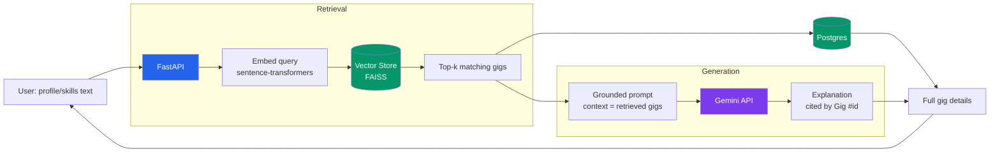

# FindMyGig AI

An AI-powered gig/freelance project-matching platform. Agents rank open freelance/gig listings by fit to a developer's skills, experience, and *win-likelihood* — based on profile match and client history — using RAG-based semantic matching over listing and profile data.

**Status:** 🚧 Active development — Week 1 of a 4-week build sprint complete

## Why this exists

Freelance/gig platforms dump every open listing on every user. Sorting through them to find the ones actually worth applying to — the ones that match your skills *and* that you're realistically likely to win — is manual, repetitive work. FindMyGig AI automates that triage.

## Architecture



The same pipeline is implemented three ways in this repo, each building on the last:

| Endpoint | Approach | Purpose |
|---|---|---|
| `POST /gigs/search` | Raw FAISS search, no LLM | Ranked results only, no explanation |
| `POST /gigs/recommend` | Hand-rolled RAG (raw `sentence-transformers` + FAISS + prompt string) | Understand what a RAG pipeline actually does, step by step |
| `POST /gigs/recommend-langchain` | Same pipeline via LangChain (`Document`, retriever, LCEL chain) | Same result, framework-standardized components |
| `POST /gigs/recommend-agent` | Same pipeline as a LangGraph state graph (`retrieve → generate → respond`) | Explicit, inspectable state — the shape Week 2's multi-agent layer builds on |

## Tech stack

| Layer | Tech |
|---|---|
| Backend API | FastAPI |
| Orchestration | LangChain, LangGraph |
| Embeddings | sentence-transformers (`all-MiniLM-L6-v2`) |
| Retrieval | FAISS |
| Generation | Gemini API |
| Database | PostgreSQL (SQLAlchemy ORM) |
| Containerization | Docker, docker-compose |

## Roadmap

- [x] Project scaffold + FastAPI CRUD skeleton
- [x] Postgres schema + SQL practice queries
- [x] Embedding pipeline + FAISS vector search (`/gigs/search`)
- [x] RAG pipeline: retrieval + grounded LLM explanation (`/gigs/recommend`)
- [x] Same pipeline rebuilt with LangChain retriever + LCEL chain (`/gigs/recommend-langchain`)
- [x] Same pipeline as a LangGraph state graph (`/gigs/recommend-agent`)
- [x] Dockerized, docker-compose for app + Postgres
- [ ] **Week 2:** Multi-agent layer — router agent, win-likelihood scoring agent, tool-calling
- [ ] **Week 3:** Kubernetes, MLflow, CI/CD, cloud deployment
- [ ] **Week 4:** Evaluation metrics, robustness testing, polish

## Running it — Docker (recommended)

```bash
# 1. Set your Gemini API key
cp .env.example .env
# edit .env and add GEMINI_API_KEY=your_key_here

# 2. Build and run everything (app + Postgres) in one command
docker compose up --build
```

Visit `http://127.0.0.1:8000/docs` for the interactive API docs.

## Running it — local (no Docker)

```bash
python -m venv venv
venv\Scripts\Activate.ps1   # Windows PowerShell; use `source venv/bin/activate` on Mac/Linux

pip install -r requirements.txt
cp .env.example .env         # then fill in GEMINI_API_KEY

# Requires a local Postgres instance — see docker-compose.yml for the
# expected connection details, or run just the db service:
# docker compose up db

uvicorn app.main:app --reload
```

## Example request

```bash
curl -X POST http://127.0.0.1:8000/gigs/recommend-agent \
  -H "Content-Type: application/json" \
  -d '{"profile_text": "Python developer with FastAPI and RAG experience", "top_k": 3}'
```

Returns the top matching gigs plus a grounded, per-gig explanation of fit — citing only the retrieved listings, not inventing anything outside them.

## Project structure

```
findmygig-ai/
├── app/
│   ├── main.py                  # FastAPI app entrypoint, startup index build
│   ├── routers/                  # API route definitions
│   ├── models/                    # SQLAlchemy DB models
│   ├── schemas/                    # Pydantic request/response schemas
│   └── services/
│       ├── embeddings.py            # Raw sentence-transformers embedding
│       ├── vector_store.py           # Raw FAISS index
│       ├── llm.py                     # Gemini API wrapper
│       ├── rag.py                      # Hand-rolled RAG pipeline
│       ├── langchain_rag.py             # LangChain-based RAG pipeline
│       └── langgraph_rag.py              # LangGraph state graph pipeline
├── sql_practice.sql             # SQL practice queries against this schema
├── docker-compose.yml
├── Dockerfile
├── requirements.txt
└── .env.example
```
